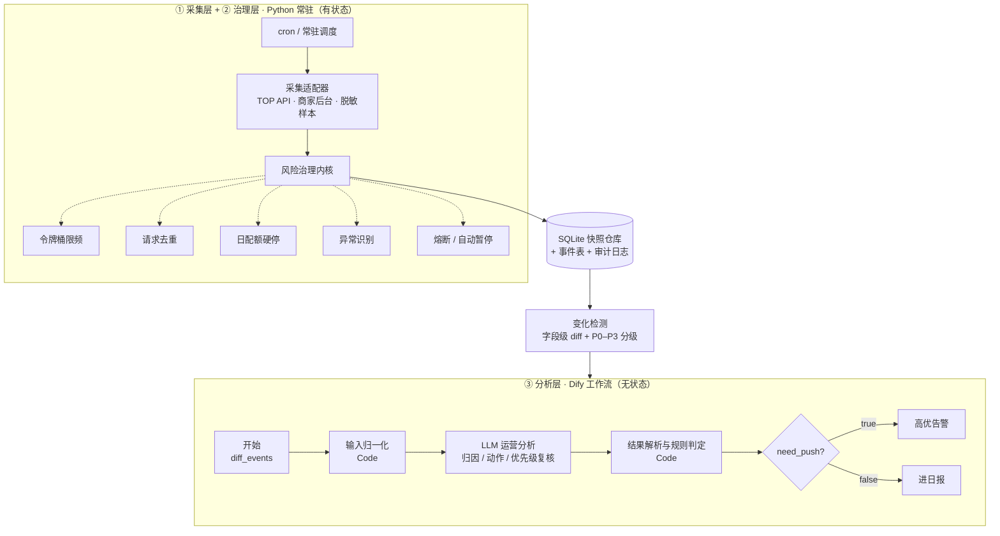

# 淘宝商品与竞品监控 Agent

> 面向电商运营场景的商品与竞品监控系统：定时采集公开商品信息 → 识别关键变化 → 生成可执行运营建议 → 全程自我约束访问频率。

这是一个**完整可运行**的实现，不是设计稿。采集与风险治理用 Python 实现（有状态，常驻运行），AI 语义分析交给 Dify 工作流（无状态，负责编排）。两层通过 SQLite 快照仓库解耦。

- **30/30 测试通过**（限频、去重、配额、异常分类、熔断、自动暂停、端到端链路）
- **Dify 工作流 8/8 验证通过**（4 个模型用例 + 4 个确定性容错用例）
- 配套方案文档见 [`docs/设计方案.md`](docs/设计方案.md)（或 [.docx 版](docs/基于AI的淘宝商品与竞品监控Agent设计方案.docx)）

---

## 目录

- [解决什么问题](#解决什么问题)
- [架构](#架构)
- [关键设计决策](#关键设计决策)
- [快速开始](#快速开始)
- [项目结构](#项目结构)
- [配置](#配置)
- [Dify 工作流](#dify-工作流)
- [测试与验证](#测试与验证)
- [合规声明](#合规声明)
- [License](#license)

---

## 解决什么问题

电商运营的痛点不是「看不到数据」，而是「看不过来」。一个中腰部商家通常同时盯 20～50 个竞品链接，需要关注**价格、库存、上下架、主图、标题、促销、评价**七个维度，任何一项变动都可能在几小时内影响自己的流量与转化。

人工巡检有两个无法回避的问题：覆盖密度不够（人力只能保证每天看一两次）、响应不及时（发现时活动已经结束）。

本系统用机器完成「取数 → 比对 → 归因 → 出建议」的闭环，把运营从重复劳动中释放出来，只处理机器判断不了的部分。

## 架构



| 层次 | 职责 | 载体 |
|---|---|---|
| 采集层 | 合规取数、请求签名、数据归一化 | Python 适配器 |
| 治理层 | 限频、去重、配额、异常识别、熔断、自动暂停 | Python 内核 |
| 存储层 | 快照历史、事件记录、审计日志 | SQLite |
| 分析层 | 语义归因、动作细化、优先级复核、告警分流 | Dify 工作流 |

## 关键设计决策

这一节是本项目真正的价值所在 —— 都是踩过坑之后才确认的结论。

### 1. 采集层为什么不放进 Dify

**Dify 工作流每次执行都是无状态的。** 节点跑完，变量、分支历史、失败计数全部随这次执行结束而消失。这直接导致第四项能力里的三件事无法落地：

- **限频**：需要知道「这个数据源在最近一秒内是第几个请求」；
- **去重**：需要记住「上次这个请求指纹是什么时候来的」；
- **熔断**：需要知道「前两次失败是谁记的、连续失败了几次」。

结论：**有状态的活儿不属于工作流编排器**。这和「用 Excel 当数据库」是同一类错误 —— 工具本身没错，是放错了层。

### 2. 确定性判断归代码，提示词只定义值域

LLM 只做三件事：**归因、动作细化、优先级复核**。其余全部下沉到代码。

这条线是被两次实测逼出来的：

**第一次**：提示词没定义 `role` 字段（`self` / `competitor`）的含义，模型把「自有商品降价」当成「竞品降价」分析，归因方向整个反了；给出的动作是「调整价格至 80.1 元」，而 80.1 已经是当前值，等于没有终点。

> 教训：**LLM 接业务数据翻车，多数不是模型不行，而是喂给它的字段语义模糊。**

**第二次**：补上字段定义后，又加了「字段缺失时按 competitor 处理」的兜底条款 —— 结果**连传了 `role` 的正常输入也被带偏**，模型把兜底说明当成了默认行为。

> 教训：**兜底逻辑不能写在提示词里，小模型会把它当默认行为执行。** 正确做法是把兜底前移到模型上游的代码节点：缺字段就在进模型之前补成明确的 `unknown`，提示词里只定义这个枚举值的语义。

同理，`need_push` 也由代码算，不交给模型：

```python
need_push = (severity == "P0") or (priority_keep is False)
```

原因很实在：实测中模型曾把 `severity=P0` 的事件判成 `need_push=false` —— 下游条件分支照此执行，**真正的 P0 会被静默吞掉**，告警功能名存实亡。

### 3. 去重有效期必须严格小于采集间隔

早期配置里去重 TTL 是 7200 秒，而采集间隔是 3600 秒 —— 缓存把下一轮的定时刷新整个吃掉，实际每两小时才真正取数一次，**监控等于没开**。

修法是在管线层自动按「采集间隔 / 2」截断 TTL，从机制上杜绝这个配置陷阱，而不是靠人记得别配错。

### 4. 熔断时长必须是「当前时刻 + 时长」

熔断到期时间曾被误写成单纯的持续时长（`open_until = 300.0`）而非 `now + 300.0`，导致与当前时间比较时永远已经过期 —— **熔断形同虚设**。

这类缺陷的危险之处在于「看起来在跑」，只有专门针对熔断行为的测试才能发现。

### 5. 令牌桶而不是固定间隔 sleep

固定间隔会强行拉平请求，而真实场景存在「整点批量刷新几十个竞品」的突发需求。令牌桶允许突发（桶容量），又能约束长期速率。

两个实现要点：按时间差**一次性**补令牌（不要 `while` + `sleep`）；用 `time.monotonic()` 而不是 `time.time()` —— 采集进程连续运行数天，NTP 对时把墙钟往回拨几秒，`time.time()` 就会算出负的时间差，凭空补出一整桶令牌。

## 快速开始

### 环境要求

Python 3.11+（开发环境为 3.13）。**运行采集不需要任何第三方依赖**，全部基于标准库。

```bash
git clone https://github.com/Guo-jiangwen/taobao-monitor-agent.git
cd taobao-monitor-agent
```

### 跑一轮采集

```bash
# 单轮（生产环境由 cron 调用）
python main.py once

# 连跑多轮，验证「首轮建基线、次轮出 diff」
python main.py once --cycles 4 --no-dedupe

# 常驻模式（按 config/config.json 里的调度配置轮询）
python main.py cron

# 查看最近事件与各数据源健康报告
python main.py report

# 人工确认后恢复被自动暂停的数据源
python main.py resume <source_id>
```

> **`--no-dedupe` 是调试专用开关。** 同一进程内连跑多轮时，去重缓存会把后续几轮的刷新整个吃掉（数据不更新 → diff 恒为空），极易被误判成「检测不灵」。生产环境**不要**开启，否则会失去重复请求去重的保护。

### 跑测试

```bash
python -m unittest discover -s tests
```

### 验证 Dify 工作流（可选）

```bash
pip install -r requirements.txt
python scripts/verify_dify_dsl.py
```

这个脚本会把 `dify/taobao-monitor-v3.yml` 里内嵌的**代码和提示词真跑一遍**（复刻 Dify 的 `main()` 调用约定 + 真调本地 Ollama），包含 4 个模型用例 + 4 个确定性容错用例。改完提示词先跑它，别在 Dify 界面里手动试。

## 项目结构

```
taobao-monitor-agent/
├── main.py                       # CLI 入口
├── requirements.txt              # 仅辅助脚本需要（采集层零第三方依赖）
├── config/
│   ├── config.json               # 调度、存储、风险策略
│   └── sources.json              # 数据源与监控目标（凭据走环境变量）
├── src/
│   ├── core/
│   │   ├── models.py             # 数据模型与枚举
│   │   ├── bucket.py             # 令牌桶限频器
│   │   ├── fingerprint.py        # 请求/内容指纹
│   │   └── risk.py               # 风险治理内核（限频/配额/去重/异常分类/熔断/暂停）
│   ├── collectors/
│   │   ├── base.py               # 采集器基类
│   │   ├── top_api.py            # 淘宝开放平台适配器（TOP 签名）
│   │   ├── sample.py             # 脱敏样本源（无凭据也能跑通链路）
│   │   └── registry.py           # 适配器注册表
│   ├── analysis/
│   │   └── diff.py               # 字段级变化检测 + P0–P3 分级
│   ├── store/
│   │   └── repository.py         # SQLite 快照与事件仓库
│   └── pipeline.py               # 采集 → 落库 → diff → 分级的编排
├── tests/                        # 30 个用例
├── prompts/
│   ├── analysis_v2.txt           # 提示词基线（保留用于对比）
│   └── analysis_v3.txt           # 当前版本：分类表 + 动作模板 + 结构化输出
├── dify/
│   └── taobao-monitor-v3.yml     # 可直接导入 Dify 的工作流 DSL
├── scripts/
│   ├── verify_v3_prompt.py       # 提示词本地回归
│   └── verify_dify_dsl.py        # DSL 内嵌代码与提示词端到端验证
└── docs/
    ├── 设计方案.md / .docx        # 完整方案文档
    ├── dify_setup_v3.md          # Dify 搭建说明（含常见问题排查）
    └── event_rules_worksheet.md  # 事件分类 → 动作模板定制指南
```

## 配置

### 数据源与凭据

`config/sources.json` 里**不写任何真实凭据**，只用环境变量占位符：

```json
{
  "id": "taobao_open",
  "adapter": "top_api",
  "compliance": "official_api",
  "credentials_env": ["TAOBAO_APP_KEY", "TAOBAO_APP_SECRET"],
  "params": {
    "app_key": "${TAOBAO_APP_KEY}"
  }
}
```

运行前设置环境变量：

```bash
export TAOBAO_APP_KEY="你的 AppKey"
export TAOBAO_APP_SECRET="你的 AppSecret"
```

每个数据源**必须**声明 `compliance` 字段，缺失则管线拒绝启动 —— 从机制上防止「顺手接一个来路不明的源」。

### 风险策略

`config/config.json` 的 `risk` 段集中管理所有阈值：

| 参数 | 默认值 | 说明 |
|---|---|---|
| `qps` | 0.5 | 每秒请求数上限 |
| `burst` | 3 | 令牌桶容量（允许的突发量） |
| `daily_quota` | 2000 | 每源每日调用硬上限 |
| `dedupe_ttl_seconds` | 600 | 去重有效期（会被自动截断到「采集间隔/2」） |
| `breaker.failure_threshold` | 5 | 连续失败多少次打开熔断 |
| `breaker.open_seconds` | 60 | 熔断初始时长（按指数退避逐次拉长） |
| `pause_after_breaker_opens` | 3 | 反复熔断多少次自动暂停该源 |
| `pause_after_consecutive_failures` | 5 | 连续失败多少次自动暂停该源 |

## Dify 工作流

工作流文件：[`dify/taobao-monitor-v3.yml`](dify/taobao-monitor-v3.yml)（Dify 1.x DSL，`version: 0.3.1`）

**导入方式**：Dify → 工作室 → 创建应用 → 导入 DSL 文件。

链路含 7 个节点：

```
开始 → 输入归一化(Code) → LLM 运营分析 → 结果解析与规则判定(Code) → 条件分支
                                                        ├─ true  → 高优告警
                                                        └─ false → 进日报
```

导入后需要确认 LLM 节点的模型配置（DSL 里写的是 `langgenius/ollama/ollama` + `qwen2.5:7b`，换环境后可能需重选）。

> 详细搭建步骤、代码节点写法、常见问题排查见 [`docs/dify_setup_v3.md`](docs/dify_setup_v3.md)。
>
> **注意**：Dify 代码节点的入口是 `def main(形参名)`，节点里声明的变量名直接作为函数参数 —— **没有 `__inputs` 这种写法**。

## 测试与验证

```bash
python -m unittest discover -s tests
# Ran 30 tests ... OK
```

覆盖范围：

- 令牌桶的突发能力、补充速率、容量上限、**并发不超发**
- 风险治理的限频、去重命中、配额硬停、异常分类、熔断开合、自动暂停与人工恢复
- 端到端的采集 → 落库 → 比对 → 分级全链路

端到端实测输出（脱敏样本源，连跑四轮）：

```
cycle 1: fetched=3  saved=3   events=0   top=P3   （首轮建基线）
cycle 2: fetched=6  saved=6   events=4   top=P1   [P1] 评分下滑 / [P1] 价格变动 +11.1%
cycle 3: fetched=9  saved=9   events=6   top=P0   [P0] 价格变动 -14.3% / [P1] 评分下滑
cycle 4: fetched=12 saved=12  events=9   top=P0   [P0] 价格变动 -10.0% / [P1] 价格变动 +16.7%
```

首轮无事件（无历史基线可比对）属预期行为；从第二轮起稳定产出变化事件并正确分级。

## 合规声明

本项目**只处理公开信息**，并在设计上做了硬性约束：

1. **数据来源白名单** —— 仅限官方开放平台接口、商家自有后台导出、有书面授权的第三方数据服务。每个数据源必须声明合规依据，缺失即拒绝启动。
2. **不触碰非公开数据** —— 不模拟登录、不绕过验证码、不抓取需登录才可见的内容、不使用未授权爬虫服务。
3. **访问量自我约束** —— 限频 + 日配额双重约束，实际调用量控制在授权额度的安全水位以下。
4. **异常即收敛** —— 一旦识别到限流、验证或鉴权失效，立即熔断而非重试加码。
5. **全链路留痕** —— 每次请求的成功与失败均写入审计日志，可回溯、可举证。

仓库内的 `sample` 数据源为**本地合成的脱敏数据**，不连接任何真实商品页面，用于在没有凭据的环境中跑通链路和运行测试。

> 使用前请自行确认符合淘宝开放平台的服务条款及当地法律法规。使用者需对自己的调用行为负责。

## License

[MIT](LICENSE)
